# MediVerse EMR

MediVerse EMR is a full-stack **Enterprise Clinic Management and Electronic Medical Record (EMR) System** designed to streamline clinical workflows. It enables secure management of patients, appointments, consultations, prescriptions, laboratory services, pharmacy operations, billing, and role-based access through a modern React frontend and a Spring Boot backend.

## Table of Contents

- [Features](#features)
- [Architecture](#architecture)
- [Tech Stack](#tech-stack)
- [Project Structure](#project-structure)
- [Screenshots](#screenshots)
- [Getting Started](#getting-started)
- [API Documentation](#api-documentation)
- [Future Enhancements](#future-enhancements)
- [Author](#author)
- [License](#license)

## Features

### Authentication & Security
- JWT-based authentication (login, registration, password reset)
- Role-based access control (RBAC) with granular permission management
- BCrypt password hashing

### Patient Management
- Patient registration and records
- Medical history tracking
- File & document uploads

### Appointments
- Appointment scheduling
- Doctor assignment and status tracking

### Clinical
- Consultations with detailed notes
- Prescriptions with medication, dosage, and instructions

### Diagnostics
- Laboratory test requests and results

### Pharmacy
- Medicine inventory management
- Prescription dispensing

### Billing
- Invoice generation
- Payment tracking

### Dashboard & Analytics
- Role-aware dashboard with real-time analytics charts

### Administration
- User management
- Role and permission allocation

## Architecture

```
React (Vite) + Tailwind CSS
            │
            ▼
      REST APIs (JWT)
            │
            ▼
      Spring Boot 4
            │
            ▼
   MySQL + Flyway
```

## Tech Stack

| Layer | Technology |
| ----- | ---------- |
| Frontend | React 19, Vite 8, Tailwind CSS 4, React Router, Recharts |
| Backend | Java 21, Spring Boot 4.1, Spring Security, Spring Data JPA |
| Database | MySQL, Flyway migrations |
| Auth | JWT (JSON Web Tokens), BCrypt |
| API Docs | Swagger UI (springdoc-openapi) |
| Build | Maven (backend), npm (frontend) |

## Project Structure

```
mediverse-emr/
├── clinic-emr-backend/    # Spring Boot REST API
│   └── src/main/
│       ├── java/com/amanchougule/clinic_emr/   # Controllers, services, entities, security
│       └── resources/db/migration/             # Flyway SQL migrations
├── clinic-emr-frontend/   # React SPA
│   └── src/
│       ├── api/           # Axios API clients
│       ├── auth/          # Login, register, password reset
│       ├── components/    # Reusable UI components
│       ├── pages/         # Feature pages (patients, appointments, billing, etc.)
│       └── routes/        # Application routing
└── screenshots/           # App screenshots
```

## Screenshots

| Screenshot | Description |
| ---------- | ----------- |
| 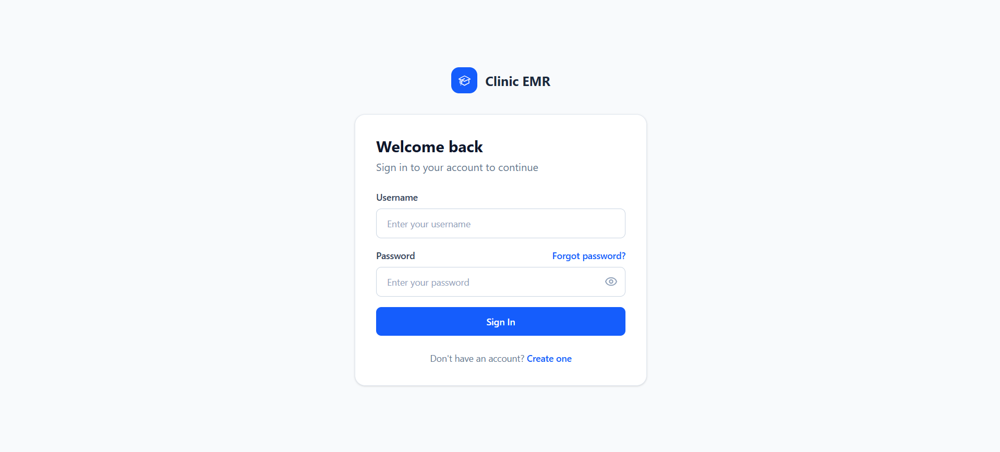 | Login page |
| 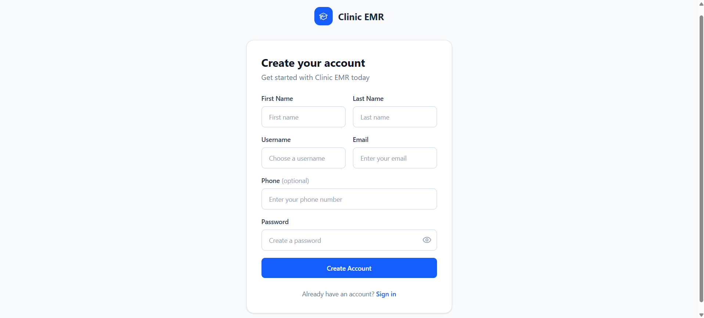 | Register page |
| 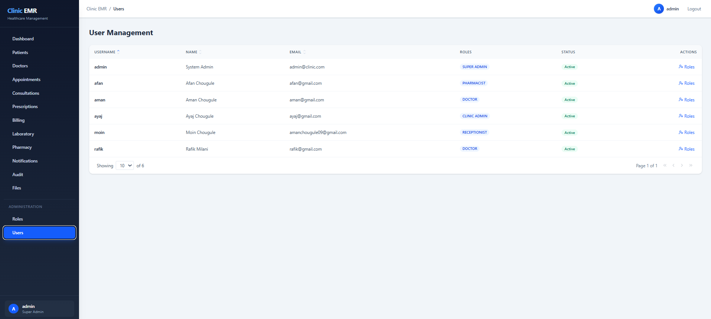 | Admin user management |
| 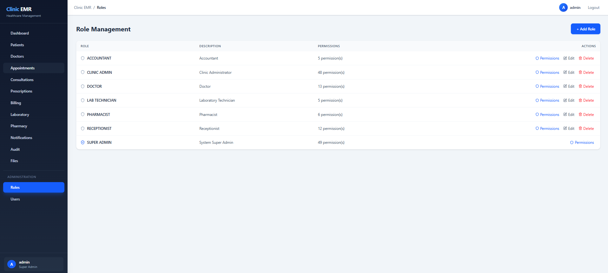 | Role Management management |
| 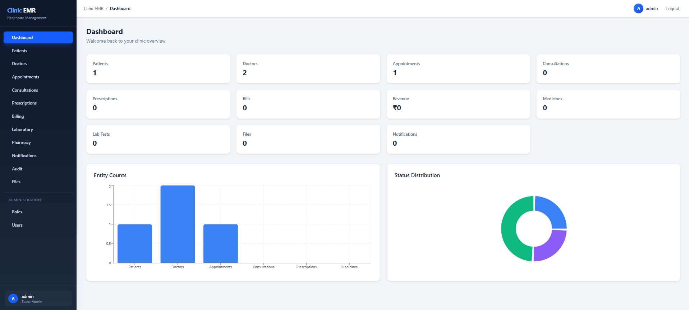 | Dashboard with analytics |
| 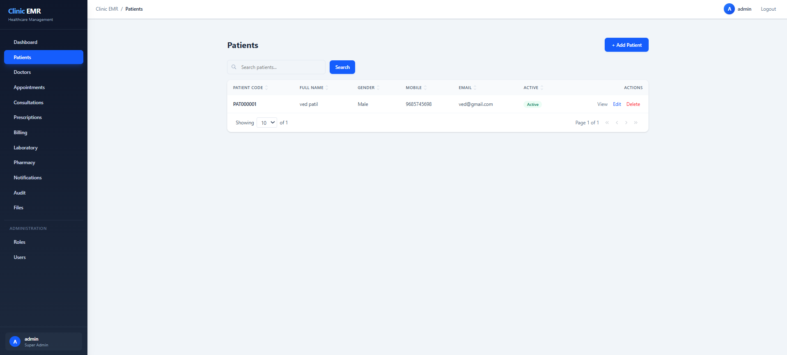 | Patient management |
| 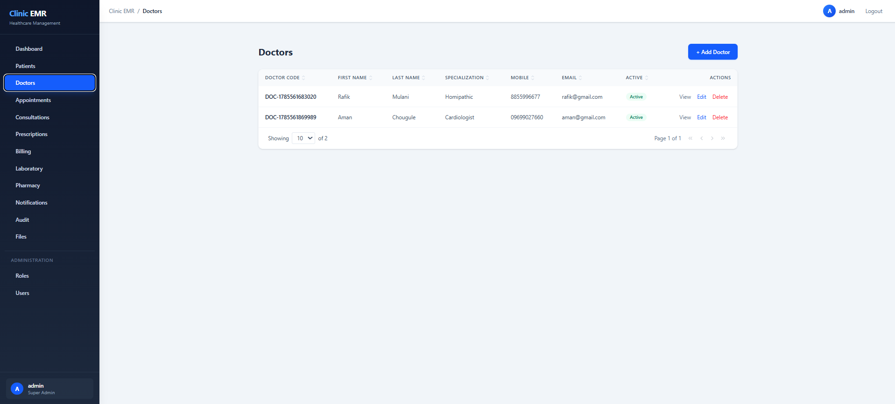 | Doctor management |
| 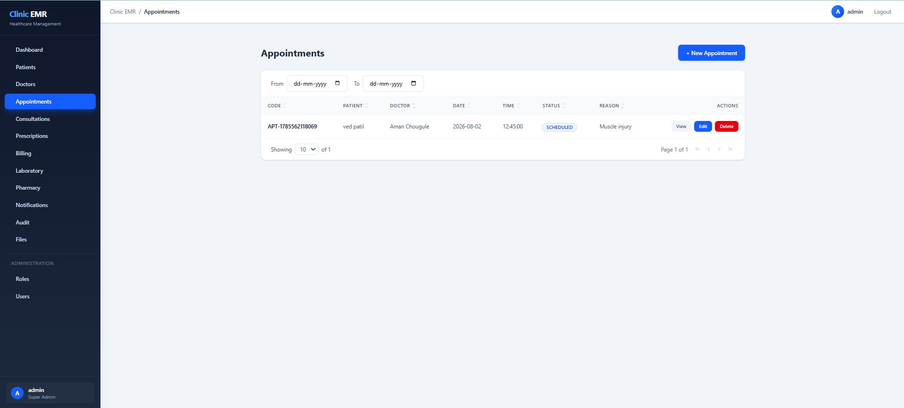 | Appointment scheduling |
| 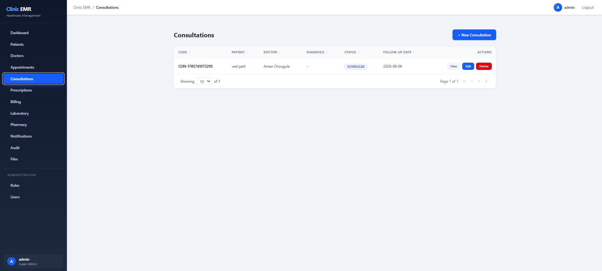 | Clinical consultations |
| 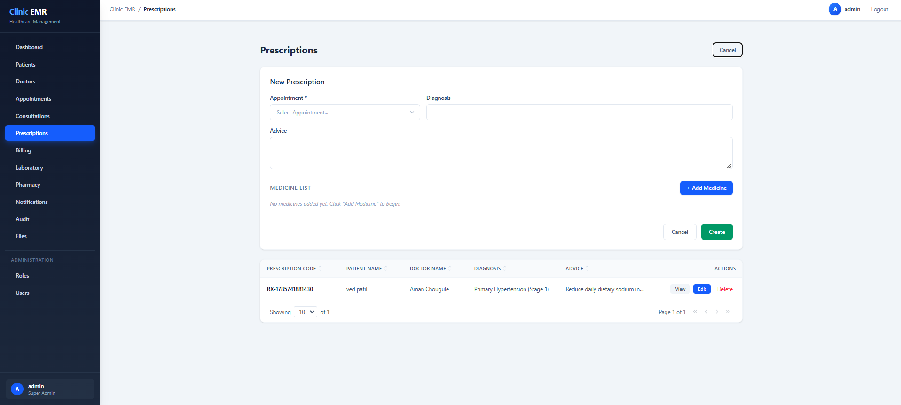 | Prescription management |
| 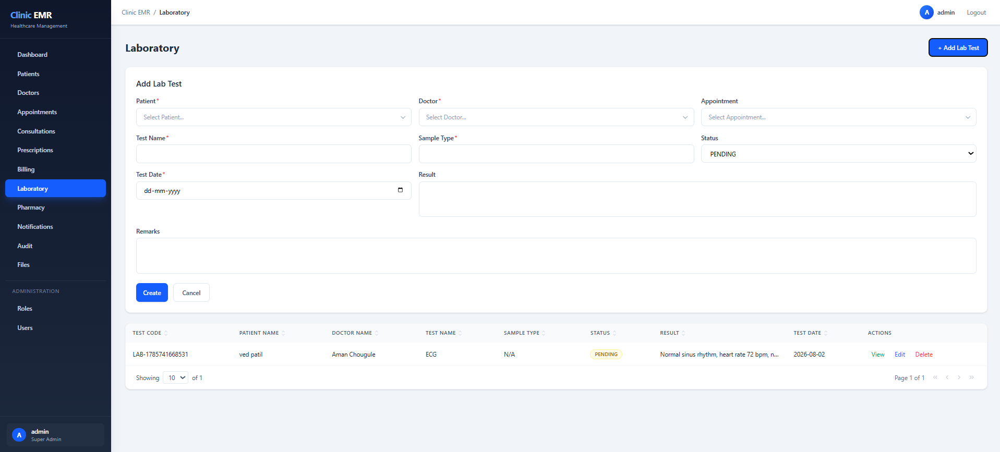 | Laboratory tests |
| 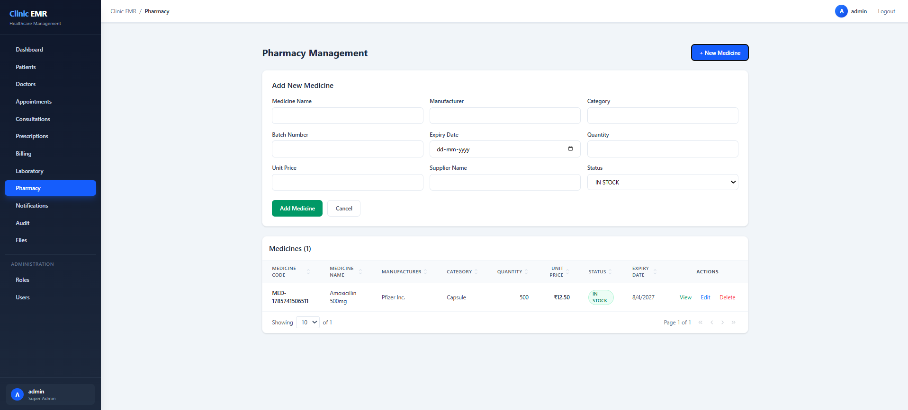 | Pharmacy operations |
| 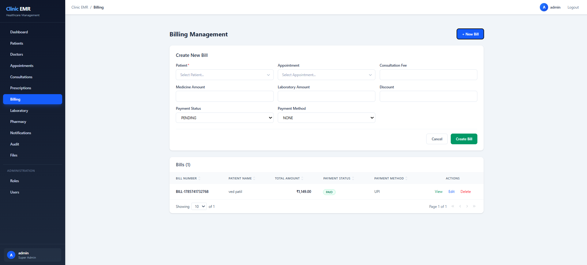 | Billing & payments |

## Getting Started

### Prerequisites

- JDK 21, Maven 3.x
- MySQL 8+
- Node.js 18+, npm

### Backend Setup

1. Create the database (Flyway will create the tables automatically):
   ```sql
   CREATE DATABASE IF NOT EXISTS clinic_emr_db;
   ```

2. Set the environment variables (copy `clinic-emr-backend/.env.example`):
   ```
   DB_URL=jdbc:mysql://localhost:3306/clinic_emr_db?createDatabaseIfNotExist=true&useSSL=false&serverTimezone=Asia/Kolkata
   DB_USERNAME=root
   DB_PASSWORD=your_db_password_here
   JWT_SECRET=your_64_character_jwt_secret_here
   JWT_EXPIRATION=86400000
   ```

3. Run the API (default port `8080`):
   ```bash
   cd clinic-emr-backend
   ./mvnw spring-boot:run
   ```

> **Note:** `DB_PASSWORD` and `JWT_SECRET` are required — the app will not start without them. On Windows PowerShell, set them with `$env:DB_PASSWORD = "..."` before running.

### Frontend Setup

1. Install dependencies:
   ```bash
   cd clinic-emr-frontend
   npm install
   ```

2. Configure the API URL — copy `.env.example` to `.env` and set:
   ```
   VITE_API_URL=http://localhost:8080
   ```

3. Start the dev server:
   ```bash
   npm run dev
   ```

4. Production build:
   ```bash
   npm run build
   ```

## API Documentation

Interactive API documentation is available via Swagger UI once the backend is running:

- **Swagger UI:** http://localhost:8080/swagger-ui/index.html
- **OpenAPI spec:** http://localhost:8080/v3/api-docs

## Future Enhancements

- Email notifications
- OTP-based authentication
- SMS integration
- Doctor queue management
- Triage & vitals tracking
- Docker deployment
- CI/CD pipeline

## Author

**Aman Chougule**

- GitHub: [amanchougule09](https://github.com/amanchougule09)
- LinkedIn: [Add your LinkedIn URL]

## License

This project is licensed under the MIT License — see the [LICENSE](LICENSE) file for details.
